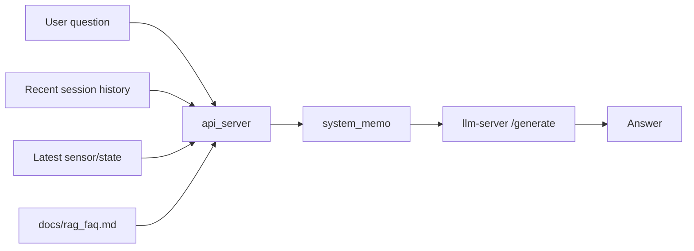
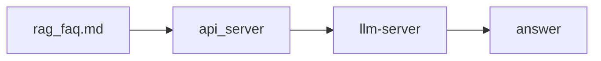

# 04_alpha_basic_rag_report

## 목적
- 알파 4번 기초 RAG를 파일 기반 FAQ부터 시작한다.
- LLM 서버는 그대로 두고, API 서버가 `system_memo`를 만들어 전달한다.

## 구현 내용
- `api_server/main.py`
  - `docs/rag_faq.md`를 읽는 파일 기반 검색을 추가했다.
  - 질문, 최근 대화, 센서 상태를 합쳐 RAG system memo를 생성한다.
  - 선택된 FAQ 섹션은 top-k 방식으로 시스템 메모에 짧게 주입한다.
  - `request_llm`에 `system_memo`를 추가했다.
- `docs/rag_faq.md`
  - 세션, 센서, 음성 저장, 운영 주의사항을 담은 초안 FAQ를 추가했다.

## 검색 방식
- 질문 토큰과 FAQ 섹션 텍스트의 단순 키워드 매칭으로 점수를 계산한다.
- 상위 3개 섹션만 사용한다.
- 최근 대화는 마지막 4턴만 짧게 정리한다.
- 센서 문맥은 `use_sensor_context`가 true일 때만 system memo에 넣는다.

## 왜 이렇게 했나
- 벡터DB를 바로 넣지 않아도 된다.
- 파일 기반이라 수정과 검증이 빠르다.
- 현재 알파에는 이 정도가 충분하다.

## 남은 것
- FAQ 문구는 아직 초안이다.
- 검색 품질이 충분하지 않으면 나중에 테이블 기반 RAG로 바꿀 수 있다.
- `session end API`는 아직 넣지 않았다.

## 다이어그램 - 복잡한 버전

## 다이어그램 - 간결한 버전

